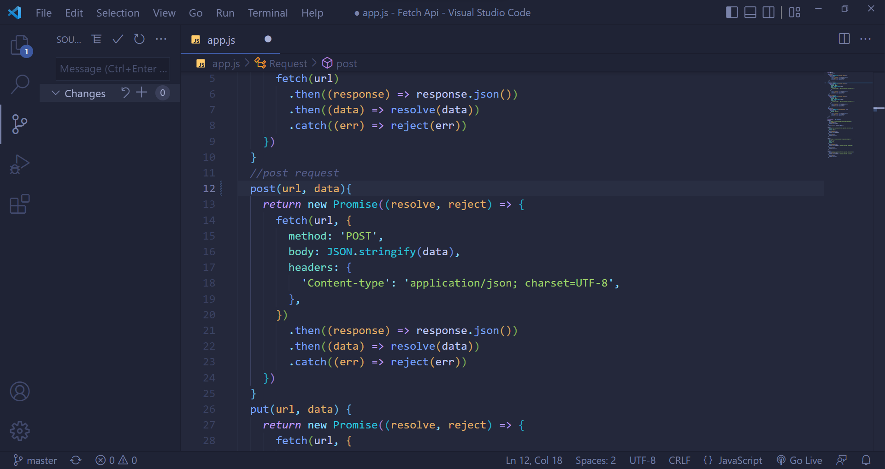
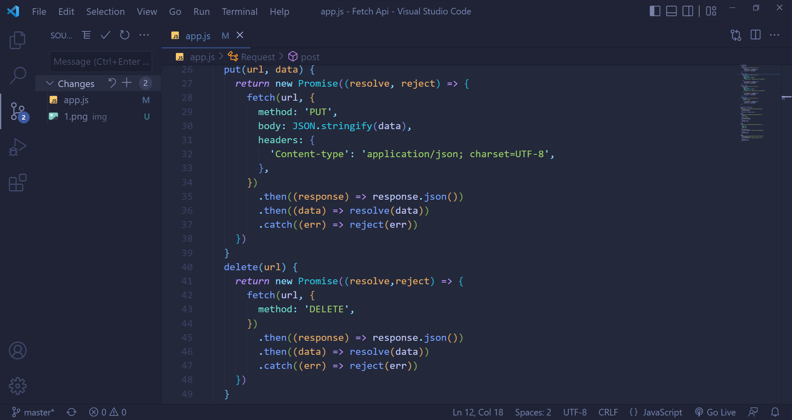
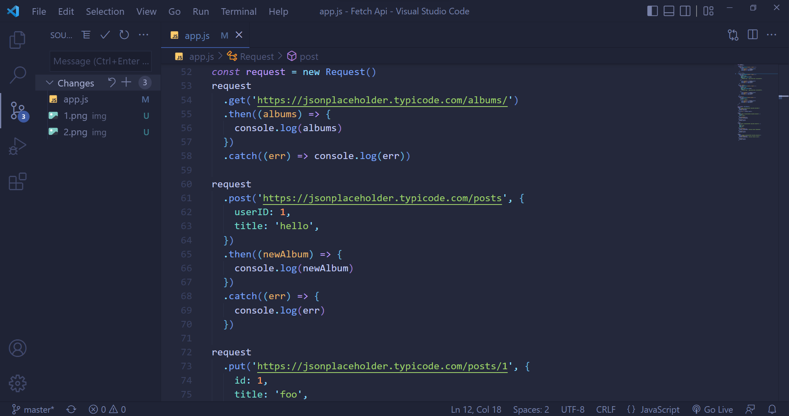
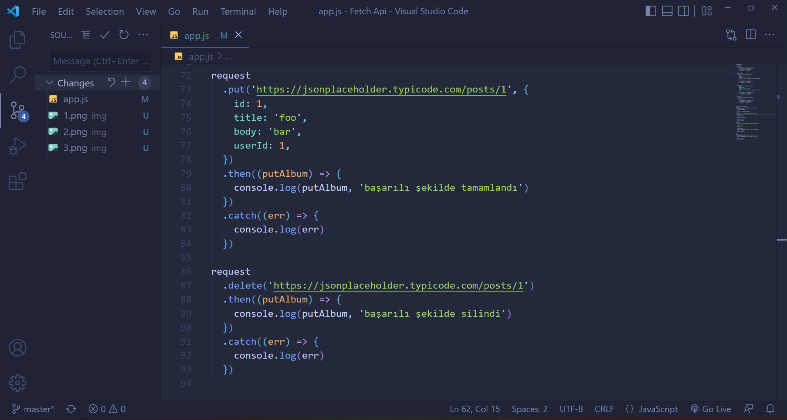

### Request Fetch Api Process 

##### Hello my name is Ayhan , In this article, I will show you the fetch function with javascript and the get, post, put and delete operation via an api. First of all, the structures I used in it were class , promis .then and catch functions. The promiss are similar to the callback functions that come with es6, but the callback functions had a disadvantage, they could be too complicated. Promis contains two parameters, two functions. If 1st parameter is resolve 2.ci then reject. What is it, what is the use of these parameters, first we started the data extraction process and we captured this incoming data in json style with the then function, and we wrote the resolve in the next then operation. resolve returns fulfiled if data is successful The .catch function, on the other hand, works when we do not receive any data and enters the reject function here, and if there is a failure, an error message will be returned to us. To summarize briefly, js, fetch function and get,put,post,delete operations are all. It gives us a lot of advantages with both its ease of writing and readability of code. easier and more useful than ajax syntax , in this me article thank you . good bye , good luck , me Ayhan .

